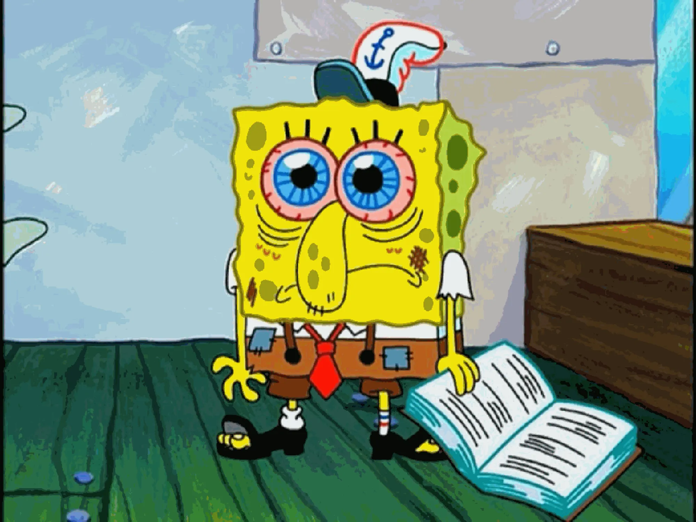

# ČVUT OI výpisky


This repository contains study materials for the final exams at CTU FEE OI. If this doesn’t ring a bell, then this repo probably won’t be very helpful for you. Also, it is entirely in Czech ☺. 

# If you are one of those fake CTU students who don’t have final exams anymore, consider yourself personally attacked. You are beneath us. 

Online verze zde: [ČVUT OI výpisky](https://mrshasha.github.io/cvut/)
## Obsah

### Společné předměty

| Stav        | Předmět                        | Poznámka      |
| ----------- | ------------------------------ | ------------- |
| ⚠️ Revize   | Kombinatorická optimalizace 💀 | Jirka + Artur |
| ✅ Dokončené | Teorie algoritmů 💀            | Artur         |
| ✅ Dokončené | Pokročilá algoritmizace 💀     | Matěj         |
### Softwarové inženýrství

| Stav            | Předmět                       | Poznámka |
| --------------- | ----------------------------- | -------- |
| ✅ Dokončené     | Databáze 2 😊                 | Jirka    |
| ✅ Dokončené     | Softwarové architektury 😊    | Artur    |
| ✅ Dokončené     | Bezpečnost systémů 😊         | Jirka    |
| ✅ Dokončené     | Efektivní software 🤨         | Jirka    |
| 🟡 Rozpracované | Paralelní algoritmy 💀        | Jirka    |
| ✅ Dokončené     | Zajištění kvality software 😊 | Artur    |
### Počítačová grafika

| Stav             | Předmět                                 | Poznámka |
| ---------------- | --------------------------------------- | -------- |
| 🟡 Rozpracované  | Algoritmy počítačové grafiky            | Vojta    |
| ❌ Nerozpracované | Datové struktury počítačové grafiky     |          |
| ❌ Nerozpracované | Multimédia a počítačová animace         |          |
| ❌ Nerozpracované | Výpočetní geometrie                     |          |
| 🟡 Rozpracované  | Vizualizace                             | Matěj    |
| ✅ Dokončené      | Geometrie počítačového vidění a grafiky | Matěj    |
## Pravidla
 Pracujte kvalitně s odkazy. Kouzlo Obsidianu je ta provázanost a rychlost psaní a hledání informací. Vyhněte se LLM dumpům velkých textů, ve kterých se relevantní informace nalézá "někde uvnitř". Also obrázky vydají za tisíc slov. Pravidelně fetchujte a zálohujte na git.

**Jak na odkazy:**

`[[Odkaz na markdown soubor]]`

`[[Odkaz na markdown soubor#Nadpis uvnitř souboru]]`

`[[Nějaký odkaz|Label co se zobrazí reálně v textu]]`

https://obsidian.md/help/syntax


**Jak na interaktivní widgety:**

Vložte je jako html soubor do web/static/Assets/předmět a do .md souboru je pak importujte jako:
```html
<iframe 
    src="https://mrshasha.github.io/cvut/Assets/ESW/cache.html" 
    width="100%" 
    height="600px" 
    frameborder="0" 
    style="border-radius: 8px; border: 1px solid #444;">
</iframe>

```
V Obsidianu se začnou renderovat až poté, co se vygeneruje web, jelikož si to tahá z webu a ne lokálně. Lokálně by to nefungovalo kvůli CSP pravidlu a takhle to je syncnutý i s webem.